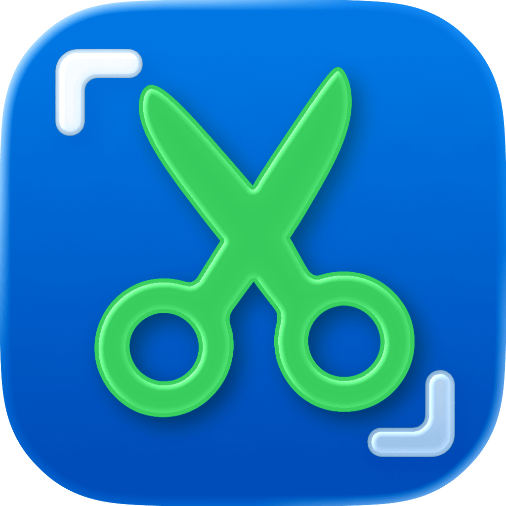
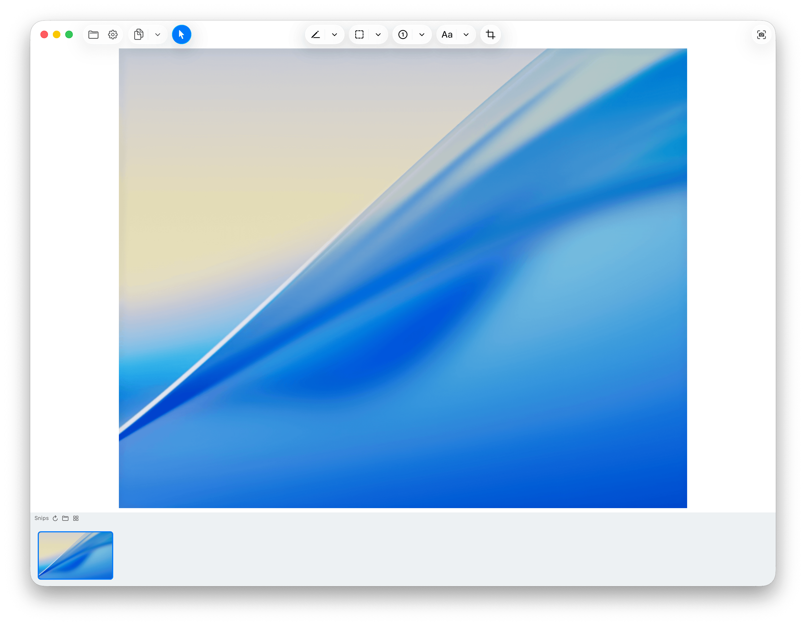
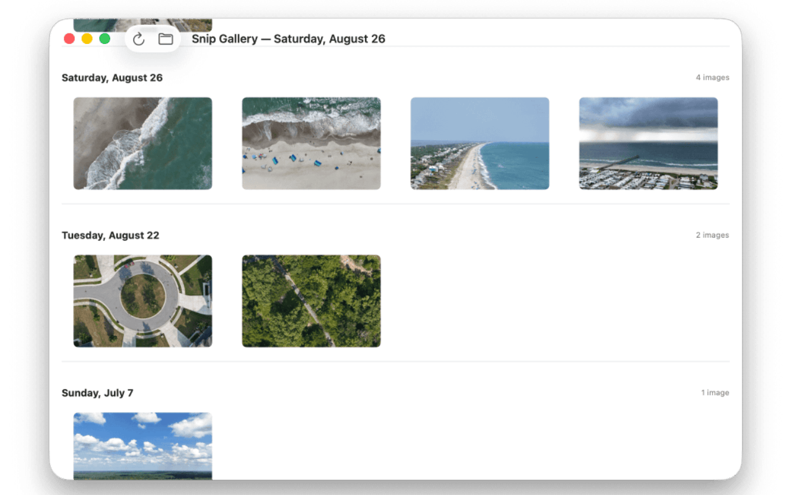

<div align="center">

# Screen Snap

<picture>
  <source srcset="Documentation/icon-dark.png" media="(prefers-color-scheme: dark)">
  <source srcset="Documentation/icon-light.png" media="(prefers-color-scheme: light)">
  
</picture>
<br/><br/>

A small yet powerful **macOS app** for taking & editing screenshots!

Inspired by Greenshot on Windows - the goal is to make a tiny app that can do the basics and a little more. 

</div>

## Work in Progress
- <del>Undo & Redo
- <del>Add Text fields with font colors, sizes, and background fill.</del>
   - Click onto text area to adjust it. Not spwan new text boxes.
- <del>Add lines with arrows. 
- <del>Objects should be eraseable with delete key.
- <del>Add auto increment numbers. 
- <del>Add Crop.
- <del>Lines, Arrows, Shapes, numbers, etc should all be moveable objects. 
- Open existing file
- Paste on top & move stuff around. 
- Image browser. 
- Add User Settings 
  - User defined save folder. 
  - User defined output type (PNG / JPG / HEIC)
- Global system hotkey for screenshots. 
- More as I think of it. 😊


## 🖥️ Screenshots 

<!-- <p align="center">
    <a href="Documentation/App1.png"></a>
    <a href="Documentation/App2.png"></a>
</p> -->

## 🖥️ User Interface


## 🔍 Troubleshooting


## 🖥️ Install & Minimum Requirements

- macOS 15.0 or later  
- Apple Silicon & Intel (Not tested on Intel)
- ~20 MB free disk space  


### ⚙️ Installation

Download from Releases. It's signed & notarized!

### ⚙️ Build it yourself!

Clone the repo and build with Xcode:

<!-- ```bash
git clone https://github.com/gbabichev/thumbnailer.git
cd thumbnailer
open thumbnailer.xcodeproj
``` -->

## 📝 Changelog

### 1.0 
- Not released yet. Build yourself to follow along!

## 📄 License

MIT — free for personal and commercial use. 