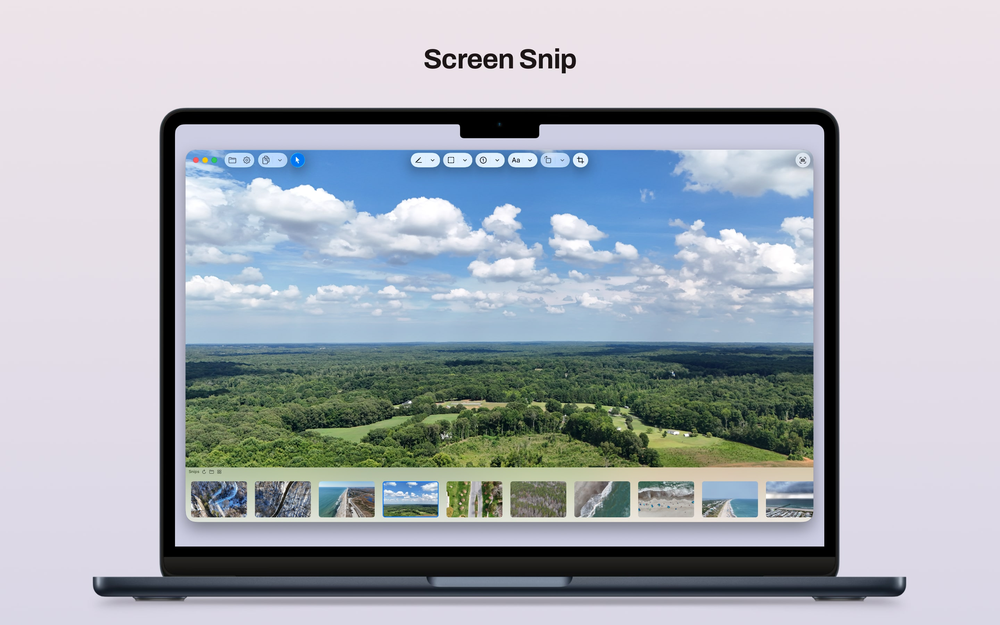
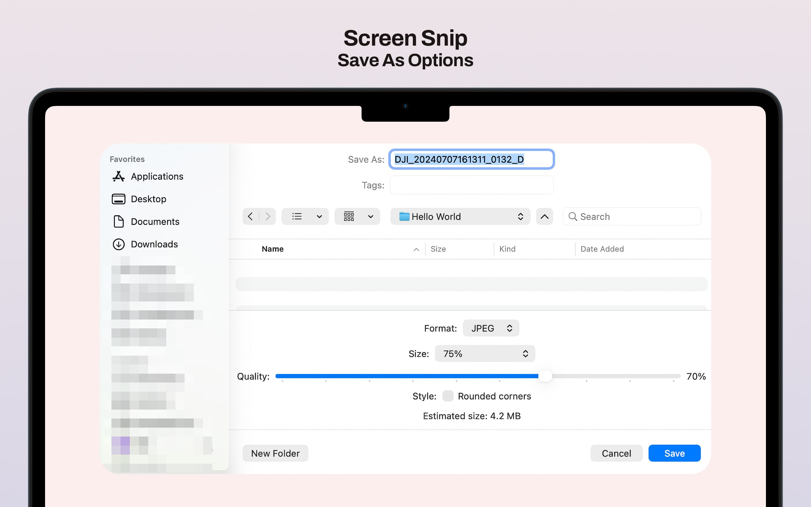
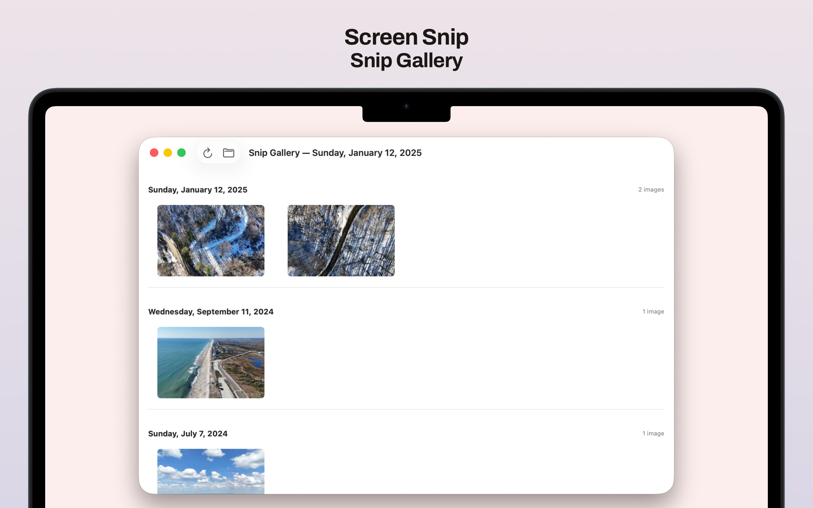

<div align="center">

<picture>
  <source srcset="Documentation/icon-dark.png" media="(prefers-color-scheme: dark)">
  <source srcset="Documentation/icon-light.png" media="(prefers-color-scheme: light)">
  
</picture>

## Screen Snip

Fast, native screenshots for Mac.

[Website](https://gbabichev.github.io/Screen-Snip/) ·
[Mac App Store](https://apps.apple.com/us/app/screen-snip/id6752541530) ·
[Support](https://gbabichev.github.io/Screen-Snip/Documentation/Support.html) ·
[Privacy](https://gbabichev.github.io/Screen-Snip/Documentation/PrivacyPolicy.html)

</div>

<p align="center">
  <a href="Documentation/App1.jpg"></a>
  <a href="Documentation/App3.jpg"></a>
  <a href="Documentation/App2.jpg"></a>
</p>

<p align="center">
  <strong>Product website:</strong>
  <a href="https://gbabichev.github.io/Screen-Snip/">gbabichev.github.io/Screen-Snip/Documentation/</a>
</p>

Screen Snip is a focused screenshot utility for macOS. It is built for people who take a lot of screenshots and want the job done without turning it into a mini design project.

## Features

- Global hotkey capture, even while the app is running in the background
- Fast markup tools:
  - Pen
  - Arrow
  - Highlighter
  - Rectangle / oval
  - Badge
  - Text
  - Blur
  - Crop
  - Rotation
- Copy to clipboard, save, or use Save As
- Export as PNG, JPG, or HEIC
- Snip Gallery for reopening screenshots by date
- Open existing images for editing, including Finder "Open With" integration
- Multi-monitor support
- Retina-aware downsampling options
- Free and open source
- No subscriptions, no analytics, and no network access

## Common Shortcuts

| Action | Shortcut |
| --- | --- |
| Take Screenshot | `Cmd + Shift + 2` |
| Pointer Tool | `Cmd + 1` |
| Pen Tool | `Cmd + 2` |
| Arrow Tool | `Cmd + 3` |
| Highlighter | `Cmd + 4` |
| Rectangle Tool | `Cmd + 5` |
| Blur Tool | `Cmd + Option + 5` |
| Oval Tool | `Cmd + 6` |
| Badge Tool | `Cmd + 7` |
| Text Tool | `Cmd + 8` |
| Crop Tool | `Cmd + 9` |
| Reset Zoom | `Cmd + 0` |
| Zoom In | `Cmd + +` |
| Zoom Out | `Cmd + -` |
| Rotate Right | `Cmd + R` |
| Rotate Left | `Cmd + Shift + R` |

## Settings

- Configurable save destination
- PNG / JPG / HEIC export
- Quality sliders for JPG and HEIC
- Retina downsampling options for saves and clipboard copies
- Auto-save on copy
- Unsaved-changes confirmation
- Fit-to-window viewing
- Optional hidden Dock icon
- Start on login

## Install

### Requirements

- macOS 26.0 or later
- Apple Silicon and Intel Macs
- Intel is not actively tested
- About 20 MB of free disk space

### App Store

- [Download Screen Snip](https://apps.apple.com/us/app/screen-snip/id6752541530)

### Releases

- Download signed and notarized builds from GitHub Releases

### Build From Source

```bash
git clone https://github.com/gbabichev/Screen-Snip.git
cd Screen-Snip
open "Screen Snip.xcodeproj"
```

## Recent Changes

### 1.4.1

- Added rounded corners in the Save As dialog
- Increased undo history from 3 snapshots to 20
- Fixed object morphing issues during rotate / undo edge cases

### 1.4.0

- Added image rotation
- Added estimated file size in Save As
- Made crop non-destructive until save
- Added optional unsaved-changes warning
- Fixed Save As filename selection and Snip Gallery year sorting issues

### 1.3.0

- Added export type, quality, and size controls in Save As
- Fixed text box movement during save
- Fixed rectangle color preview during drag

### 1.2.1

- Improved text editing with select-all, drag-sized text boxes, and easier re-editing
- Fixed format persistence, edge-movement glitches, crop thumbnail refresh, and crop box deletion

## License

MIT. Free for personal and commercial use.

## Support

Support is handled through [GitHub Issues](https://github.com/gbabichev/Screen-Snip/issues).

## Privacy

See the [Privacy Policy](Documentation/PrivacyPolicy.html).
