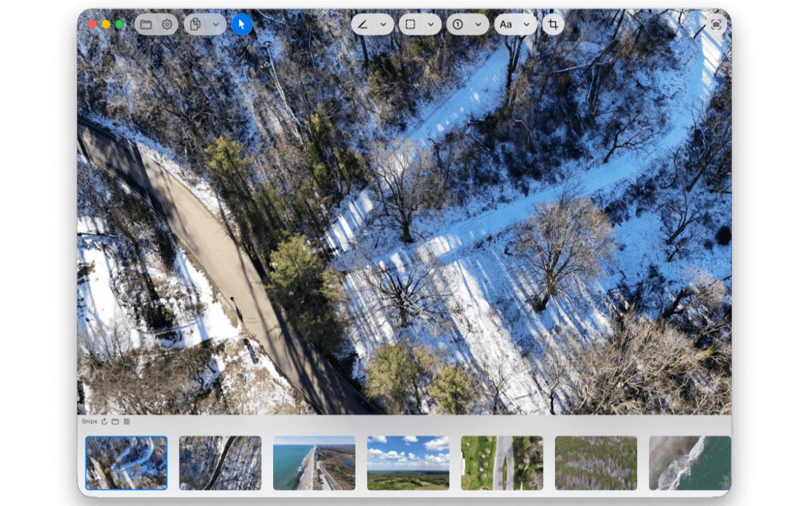

<div align="center">

<picture>
  <source srcset="Documentation/icon-dark.png" media="(prefers-color-scheme: dark)">
  <source srcset="Documentation/icon-light.png" media="(prefers-color-scheme: light)">
  
</picture>
<br/><br/>

<h2>Fast, powerful, and beautifully simple screenshots for Mac.</h2>
<br><br>

</div>

<p align="center">
    <a href="Documentation/App1.png"></a>
    <a href="Documentation/App3.png"></a>
    <a href="Documentation/App2.png"></a>
</p>

## 🖥️ Features, Tools, and Settings

### Features

- Take screenshots!
  - With a global hotkey even when the app is in the background. 
- Multi monitor support. 
- Retina display ready. 
- Open Images for editing. 
  - Native "Open With" integration in Finder. 
- Copy to Clipboard / Save / Save As. 
- Undo / redo!
- Paste objects on canvas from clipboard. 
- Rotation support for rectangles, text, and pastes from clipboard. 
- Hold SHIFT while rotating to snap every 15 degrees. 
- Pinch to zoom / Double tap to zoom / cmd + scroll wheel to zoom. 
- Snip Gallery to view snips by date. 
- Liquid Glass first design. 
- Privacy focused - no network access or data collection - your snips are purely yours. 


### Tools

| Tool                         | Shortcut          | Notes                                          |
|:----------------------------:|:-----------------:|:----------------------------------------------:|
| Take Screenshot              | ⌘ ⇧ 2             | Command + Shift + 2                            |
| Pointer Tool                 | ⌘ 1               | Moves objects around with multi select         |
| Pen Tool                     | ⌘ 2               | Draw lines                                     |
| Arrow Tool                   | ⌘ 3               | Draw lines with arrows                         |
| Highlighter                  | ⌘ 4               | Highlights                                     |
| Rectangle Tool               | ⌘ 5               | Draw squares / rectangles                      |
| Blur Tool                    | ⌘ ⌥ 5             | Blur areas (pixelate)                          |
| Oval Tool                    | ⌘ 6               | Draw circles / ovals                           |
| Badge Tool                   | ⌘ 7               | Incremental numbers                            |
| Text Tool                    | ⌘ 8               | Insert text. Colored backgrounds optional      |
| Crop Tool                    | ⌘ 9               | Crops                                          |
| Reset Zoom                   | ⌘ 0               | Reset zoom to 100%                             |
| Zoom In                      | ⌘ +               | Increase zoom                                  |
| Zoom Out                     | ⌘ -               | Decrease zoom                                  |

### Settings

These settings are customizable by you. 
- File Save Destination
- Save Format
  - PNG
  - JPG (With Quality Slider)
  - HEIC (With Quality Slider)
- Downsample Retina Screenshots 
  - If you take a screenshot on a Retina or High-DPI (4K) display, it will downsample it to 1x immediately. 
- Automatically Save on Copy
  - When you copy to clipboard, the app can auto-save to disk. 
- Downsample Retina Screenshots for Copy
  - If a High-DPI screenshot exists, we can automatically downsample it to 1x for easier & quicker sharing. 
- Fit Images to Window
  - You can view your snips in "actual" size, or enhance them to take the full window size. 
- Hide Dock Icon
  - Since the app runs in the background, you may not want a visible dock icon constantly. 
- Start on Logon
  - Start the app when logging into your Mac. 


## 🖥️ Install & Minimum Requirements

- macOS 26.0 or later  
- Apple Silicon & Intel (Not tested on Intel)
- ~20 MB free disk space  


### ⚙️ Installation

<a href="https://apps.apple.com/us/app/screen-snip/id6752541530?mt=12
Screen Snip">Mac App Store</a>

OR 

Download from Releases. It's signed & notarized!

### ⚙️ Build it yourself!

Clone the repo and build with Xcode:

```bash
git clone https://github.com/gbabichev/Screen-Snip.git
cd Screen-Snip
open "Screen Snip.xcodeproj"
```

## 📝 Changelog

### 1.2.1
- Fixed: HEIC not saving correclty in certain cases. 
- Fixed: Objects not resizing correctly on edges. 
- Fixed: Moving multiple objects resulted in glitchy behavior when hitting edges.
- Fixed: Resizing the text box caused unwanted behavior
- Fixed: Existing images save with the correct file format if format setting was changed. 
- Fixed: Thumbnail not refreshing after a crop. 
- Fixed: Delete key can now properly delete a crop box if it's not committed. 

### 1.2.0
- Added Blur tool. 
- Selection tool can now select multiple objects. 

### 1.1.1
- Fixed rectangle tool not showing the users color during drawing when the display is in "Fit" mode. 

### 1.1.0
- Added rotation for Rectangle Tool, Text Tool, Pasted object tool. 
- New Icon 
- Snip Gallery now shows the date of snips in the Window Titlebar. 
- Adjusted Snip Gallery to load fresh snips, instead of stale snips. 

### 1.0.4
- Added keyboard navigation to move between thumbnails in the bottom row.

### 1.0.3
- Resolved issue with screen cursor not always displaying properly. 
- Optimized window close/reopen behavior during certain captures. 

### 1.0.2 
- Resolved regression with "Open With Screen Snip" not working in Finder. 

### 1.0.1
- Improved permissions UI when launching app. 

### 1.0 
- Initial Release. 

## 📄 License

MIT — free for personal and commercial use. 

## Privacy
<a href="Documentation/PrivacyPolicy.html">Privacy Policy</a>

## Support 
<a href="Documentation/Support.html">Support</a>